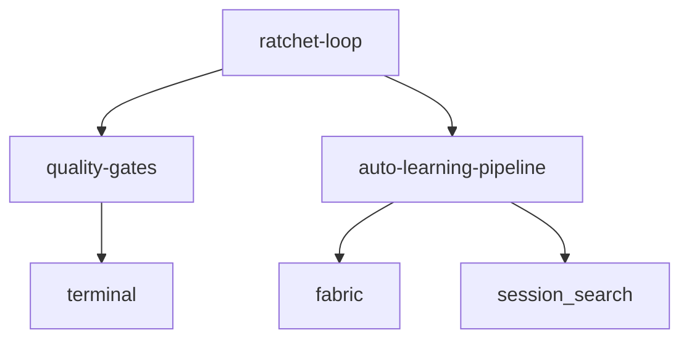
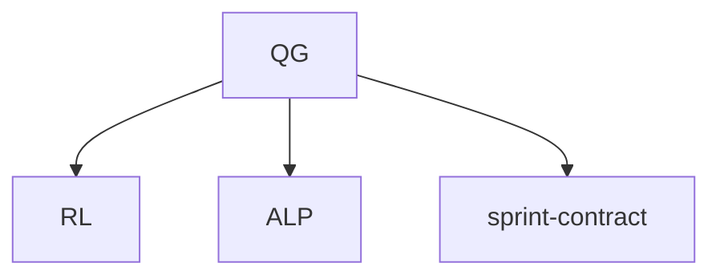
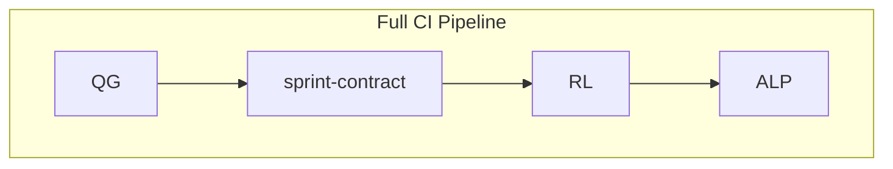

# Skill Dependency Graph

Analyze and visualize dependencies between Hermes skills. Detects implicit dependencies (skills referencing each other), circular references, orphaned skills, and suggests compositions.

## When to Use

- "Show me skill dependencies"
- "Which skills depend on quality-gates"
- "Are there circular dependencies"
- "What skills should I compose together"
- After creating/updating multiple skills

## Architecture

```
┌──────────────────────────────────────┐
│     SKILL DEPENDENCY ANALYZER        │
│                                       │
│  1. SCAN all SKILL.md files          │
│  2. PARSE YAML frontmatter           │
│     - metadata.hermes.dependencies   │
│     - metadata.hermes.compositions   │
│  3. DETECT implicit references       │
│     - grep for skill names in body   │
│  4. BUILD directed graph             │
│  5. ANALYZE:                         │
│     - cycles (circular deps)         │
│     - orphans (no dependents)        │
│     - hubs (most dependents)         │
│  6. VISUALIZE as Mermaid             │
│  7. SUGGEST compositions             │
└──────────────────────────────────────┘
```

## Quick Start

```
# Analyze all skills
"Show skill dependency graph"

# Focus on one skill
"What depends on ratchet-loop"

# Find circular dependencies
"Check for circular deps in skills"

# Suggest compositions
"Suggest skill compositions for my workflow"
```

## Graph Types

### 1. Dependency Graph (who uses whom)


### 2. Impact Graph (what breaks if X changes)


### 3. Composition Graph (skills that work together)


## Analysis Commands

### Detect Cycles
```bash
# Find circular dependencies
for skill in ~/.hermes/skills/*/SKILL.md; do
    deps=$(yq '.metadata.hermes.dependencies[]' "$skill" 2>/dev/null)
    # Check if any dep also depends on this skill
done
```

### Find Orphans
Skills with no incoming dependencies — candidates for cleanup or promotion.

### Find Hubs
Skills with most dependents — be careful when modifying these.

### Suggest Compositions
Skills that are frequently used together in sessions → suggest `metadata.hermes.compositions`.

## Auto-Maintenance

After running dependency graph:

1. **Update frontmatter**: add missing `dependencies` entries
2. **Create compositions**: for frequently co-used skills
3. **Flag issues**: circular deps, missing deps, stale refs
4. **Patch skills**: add `skill_manage(action='patch')` for each fix

## Output Format

```markdown
## Skill Dependency Report

### Summary
- Total skills: 25
- Explicit dependencies: 12
- Implicit dependencies detected: 8
- Circular dependencies: 1 ⚠️
- Orphaned skills: 3

### Circular Dependencies ⚠️
- quality-gates ↔ sprint-contract

### Hubs (most dependents)
1. quality-gates (4 dependents)
2. terminal (3 dependents)
3. fabric (2 dependents)

### Orphans (no dependents)
- netatmo-cis-demand-monitor
- belarus-financial-document-parser
- songwriting-and-ai-music

### Suggested Compositions
1. CI Pipeline: quality-gates + sprint-contract + ratchet-loop
2. Learning Stack: auto-learning-pipeline + fabric
```

## Pitfalls

1. **Implicit deps are guesses**: grep-based detection may miss indirect refs
2. **Frontmatter may be stale**: always cross-check with actual usage
3. **Compositions are suggestions**: don't auto-create without user approval
4. **Large skill sets**: scan may be slow with 50+ skills — use caching

## Verification

- [ ] All declared `dependencies` actually exist as skills
- [ ] No circular dependency chains
- [ ] At least one composition suggested if 3+ skills co-used
- [ ] Orphan report reviewed (not auto-cleaned)
